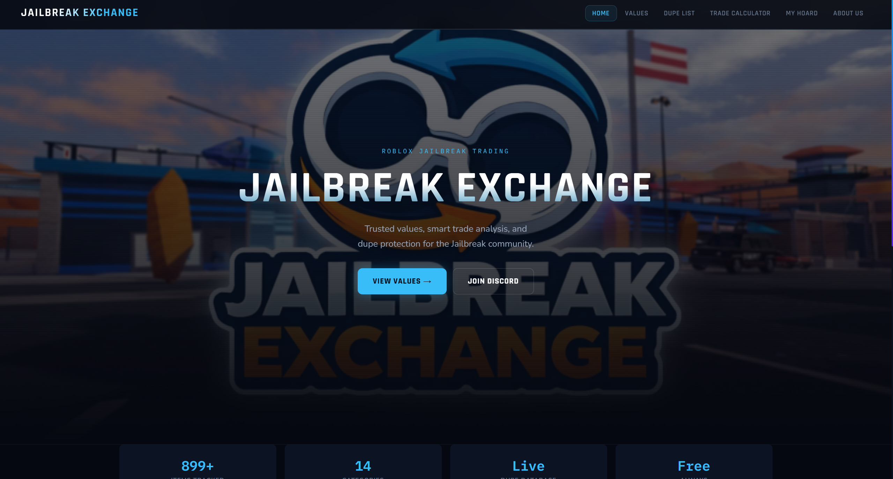
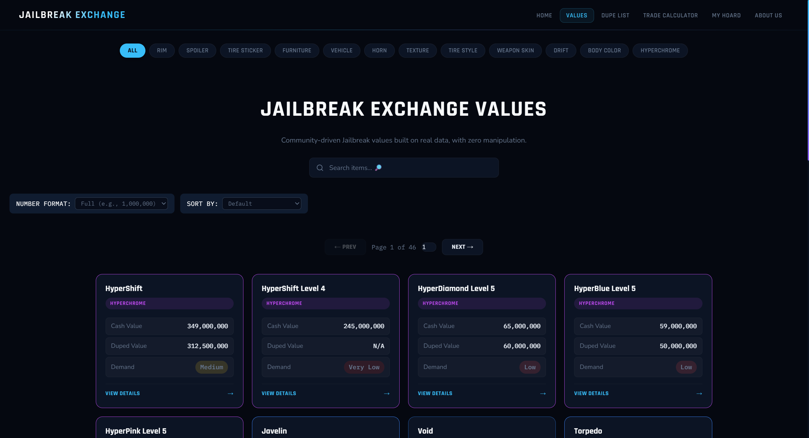
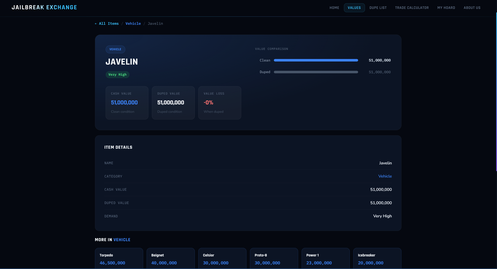
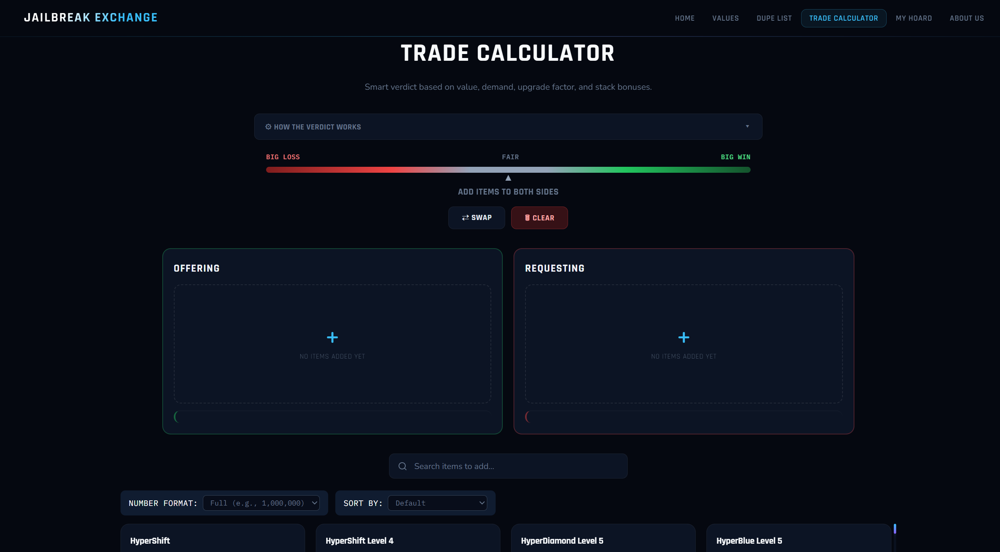
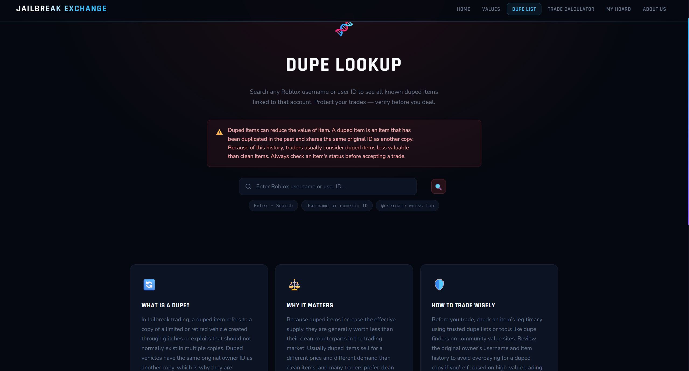

# Jailbreak Exchange

> A community-driven web platform for Roblox Jailbreak traders — providing accurate item values, smart trade analysis, dupe detection, and inventory management. Free, forever.

---
## Preview
### demo

### Home


### Value List


### Item Detail


### Trade Calculator


### Dupe Lookup


## Overview

Jailbreak Exchange is a static frontend web application built for the Roblox Jailbreak trading community. It gives players the tools they need to trade confidently: up-to-date item values, a multi-factor trade verdict engine, a community dupe database lookup, and a personal hoard manager.

The platform is fully client-side — no backend framework, no build step, no dependencies. It runs directly in the browser and falls back gracefully to a local CSV when the live API is unavailable.

---

## Features

### 📊 Item Value List (`ValueList.html` / `ValueList.js`)
- Displays all tracked Jailbreak items with their clean value, duped value, category, and demand tier
- 14 item categories, each with a distinct color label (Vehicle, Limited, HyperChrome, Seasonal, etc.)
- Real-time search filtering
- Sortable by value (high/low), demand (high/low), and name (A–Z / Z–A)
- Toggle between full number format (`1,000,000`) and short format (`1M`, `500K`)
- Data loaded from a live API with automatic CSV fallback

### 🔄 Trade Calculator (`Calculator.html` / `Calculator.js`)
A multi-factor verdict engine that goes beyond a simple value comparison. The algorithm evaluates:

1. **Raw value difference** — baseline comparison of both sides
2. **Demand adjustment** — demand tier of each item on the requesting side adjusts effective value (Very High adds +2M, Close to None subtracts -2M, etc.)
3. **Stack bonus** — offering 3+ identical high/very-high demand items triggers a 3% bundle premium per item
4. **Upgrade/downgrade overpay** — when consolidating many items into fewer (upgrade trade), an expected overpay is calculated based on demand tier difference between sides; downgrade trades mirror this in reverse
5. **Hoard override** — items marked as hoarded skip demand penalties entirely and use the owner's personal value/demand estimates

The result is plotted on an animated verdict bar across five zones: **Big Loss**, **Loss**, **Fair**, **Win**, **Big Win**. A live score breakdown shows each factor's contribution.

### 🧬 Dupe Lookup (`DupeList.html` / `DupeList.js`)
- Search any Roblox username or numeric user ID (supports `@username` format)
- Returns known duped items linked to that account from a community-sourced database
- Explains what duped items are, why they affect value, and how to trade wisely

### 🗄 Hoard Manager (`Hoard.html` / `Hoard.js`)
- Mark items as long-term investment holds
- Set a personal custom value and custom demand per item (overrides market rate in the calculator)
- Hoarded items display a distinct tag in the Trade Calculator and bypass demand penalties
- Data persisted in `localStorage` (`jbe_hoard_v2`) with automatic migration from the legacy v1 format

### 🏠 Home (`index.html`)
- Hero section with platform summary
- Live stats strip (899+ items tracked, 14 categories, live dupe database)
- Feature cards linking to all tools

### ℹ️ About Us (`AboutUs.html`)
- Platform mission and team context
- Contact section with Discord and email links

---

## Tech Stack

| Layer | Technology |
|---|---|
| Markup | HTML5 |
| Styling | CSS3 (single shared `style.css`, CSS custom properties) |
| Logic | Vanilla JavaScript (ES2020+) |
| Data | CSV (`items.csv`) + live REST API with fallback |
| Storage | Browser `localStorage` |
| Hosting | Static file hosting (no server required) |

No frameworks. No package manager. No build pipeline.

---

## Project Structure

```
jailbreak-exchange/
├── index.html          # Home page
├── ValueList.html      # Item values page
├── ValueList.js        # Value list logic (data loading, filtering, sorting)
├── Calculator.html     # Trade calculator page
├── Calculator.js       # Trade algorithm (verdict engine, scoring, rendering)
├── DupeList.html       # Dupe lookup page
├── DupeList.js         # Dupe search logic
├── Hoard.html          # Hoard manager page
├── Hoard.js            # Hoard CRUD logic + localStorage persistence
├── AboutUs.html        # About & contact page
├── style.css           # Global stylesheet (shared across all pages)
└── items.csv           # Fallback item data (name, category, value, duped_value, demand)
```

---

## Data Format

Items are sourced from a live API and fall back to `items.csv`. The CSV schema is:

| Column | Type | Description |
|---|---|---|
| `name` | string | Item display name |
| `category` | string | Item category (Vehicle, Limited, Rim, etc.) |
| `value` | number | Clean market value |
| `duped_value` | number \| N/A | Value if item is duped |
| `demand` | string | Demand tier (Very High → Close to None) |

---

## Trade Algorithm — How Verdicts Work

```
tradeScore = requestEffective - offerEffective + expectedOverpay

where:
  requestEffective = Σ(item face value) + Σ(demand adjustments)
  offerEffective   = Σ(item face value) + stackBonus
  expectedOverpay  = upgrade tax (scales with demand tier difference)
```

Verdict thresholds:

| Score | Verdict |
|---|---|
| ≥ +2,000,000 | Big Win 🔥 |
| ≥ +1,000,000 | Win ✅ |
| ≥ −500,000 | Fair ⚖️ |
| ≥ −2,000,000 | Loss ❌ |
| < −2,000,000 | Big Loss 💀 |

---

## Getting Started

No installation required. Clone the repository and open `index.html` in any modern browser.

```bash
git clone https://github.com/abdelrhmannabildev-dev/jbtsupport
cd jbtsupport
open index.html
```

For local development with live reload, any static file server works:

```bash
# Using Python
python -m http.server 8080

# Using Node.js (npx)
npx serve .
```

Then navigate to `http://localhost:8080`.

---

## Contributing

Contributions are welcome. To suggest a value correction, report a dupe, or propose a feature:

- **Discord:** [discord.gg/u7ucGJjtGU](https://discord.gg/u7ucGJjtGU) — preferred for community discussion and live feedback
- **Email:** jailbreakexchange@gmail.com — for private reports or business inquiries

---

## Disclaimer

Jailbreak Exchange is an independent community project. It is not affiliated with, endorsed by, or connected to Roblox Corporation or Badimo.

---

© 2025 Jailbreak Exchange. All rights reserved.
